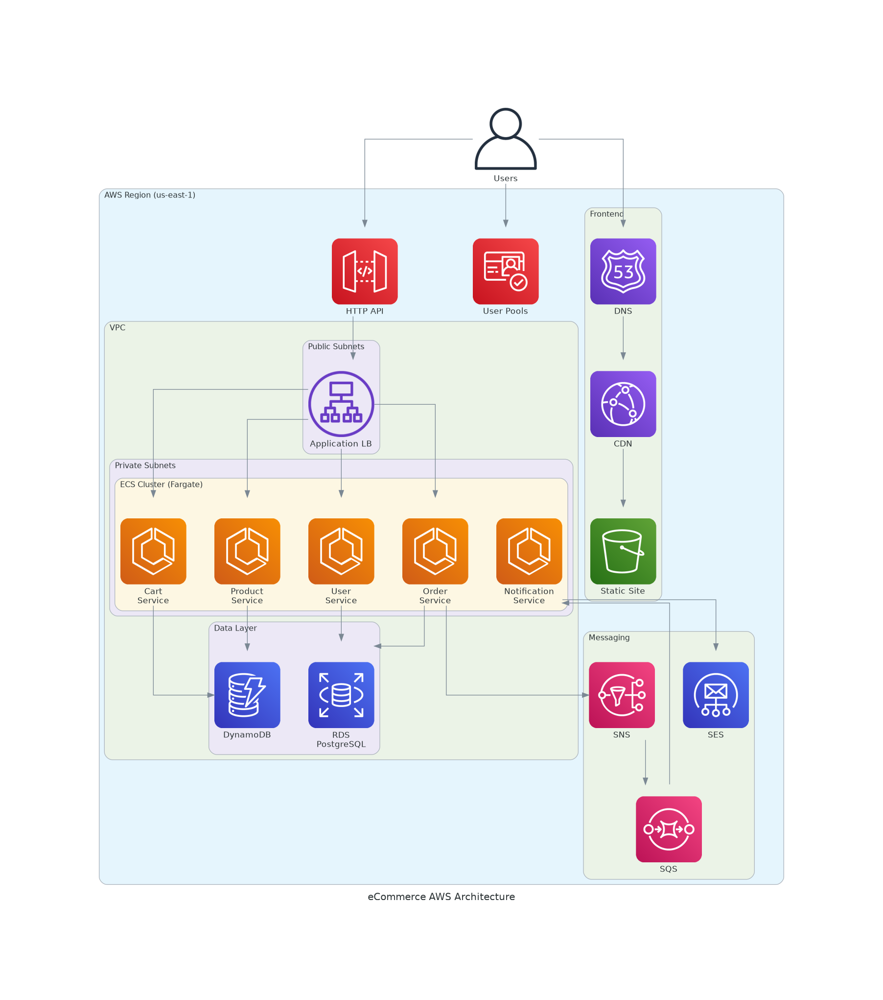

# AWS eCommerce Application - Learning Project

A production-grade microservices-based eCommerce application built for learning AWS cloud services and modern application architecture.

## 🏗️ Architecture Overview

This project demonstrates a complete cloud-native application using:

### Microservices Architecture
- **Product Service** - Product catalog management (DynamoDB)
- **Cart Service** - Shopping cart operations (DynamoDB)  
- **User Service** - User profile management (RDS PostgreSQL)
- **Order Service** - Order processing and orchestration (RDS PostgreSQL)
- **Notification Service** - Asynchronous email notifications (SNS/SQS/SES)

### AWS Services
- **Frontend**: S3 + CloudFront + Route53
- **API Layer**: API Gateway (HTTP API) + VPC Link
- **Compute**: ECS/Fargate + Application Load Balancer
- **Authentication**: Cognito User Pools
- **Databases**: DynamoDB + RDS PostgreSQL
- **Messaging**: SNS + SQS + SES
- **Networking**: VPC, Subnets, Security Groups, NAT Gateway

### Architecture Diagram



## 📋 Prerequisites

Before you begin, ensure you have the following tools installed:

- **Docker** - Container runtime
- **Docker Compose** - Multi-container orchestration
- **Node.js 20+** - Frontend development
- **Git** - Version control
- **AWS CLI** - AWS service interaction

### Quick Installation

For Amazon Linux 2023 or similar systems, run:

```bash
./install-prerequisites.sh
```

This script installs:
- Docker and Docker Compose
- Node.js 20 LTS
- Git

After installation, log out and log back in for Docker group permissions to take effect.

## 🚀 Getting Started

### Step 1: Local Deployment (Recommended)

Before deploying to AWS, it's highly recommended to test the application locally. This helps verify that:
- Docker images build correctly
- Services communicate properly
- Application logic works as expected
- You understand the application flow

**👉 [Local Deployment Guide](local-deployment/README.md)**

Local deployment uses:
- **LocalStack** - AWS service emulator (DynamoDB, SNS, SQS, SES)
- **PostgreSQL** - Local database
- **Nginx** - API Gateway simulator
- **React Dev Server** - Frontend

**Time required**: ~15 minutes

### Step 2: AWS Deployment

Once you've verified the application works locally, deploy it to AWS to learn cloud services hands-on.

**👉 [AWS Deployment Guide](deployment/README.md)**

The deployment is organized into modules:
- Module 0: Prerequisites
- Module 1: Networking (VPC, Subnets, Security Groups)
- Module 2: Data Layer (RDS, DynamoDB)
- Module 3: Authentication (Cognito)
- Module 4: Container Deployment (ECR, ECS/Fargate, ALB)
- Module 5: API Gateway (HTTP API, VPC Link)
- Module 6: Frontend Deployment (S3, CloudFront)
- Module 7: Event-Driven Architecture (SNS, SQS)
- Module 8: DNS & SSL (Route53, ACM)
- Module 9: Cleanup

**Time required**: 3-4 hours

## 💰 Cost Estimates

- **Local Development**: $0 (runs on your machine)
- **AWS Deployment** (4-hour session): ~$10-15
- **AWS Deployment** (24 hours): ~$50-75

> **Note**: Remember to clean up AWS resources after learning to avoid ongoing charges.

## 📚 Learning Objectives

By completing this project, you will learn:

1. **Microservices Architecture**
   - Service decomposition
   - Inter-service communication
   - API design

2. **Containerization**
   - Docker image creation
   - Multi-stage builds
   - Container orchestration

3. **AWS Core Services**
   - Compute: ECS/Fargate
   - Storage: S3, RDS, DynamoDB
   - Networking: VPC, ALB, API Gateway
   - Security: IAM, Security Groups, Cognito
   - Messaging: SNS, SQS, SES

4. **DevOps Practices**
   - Infrastructure as Code
   - CI/CD concepts
   - Monitoring and logging

5. **Cloud Architecture Patterns**
   - Event-driven architecture
   - Serverless components
   - High availability design

## 🗂️ Project Structure

```
ecommerce-aws-tutorial/
├── services/                    # Backend microservices
│   ├── product-service/         # Python FastAPI
│   ├── cart-service/            # Python FastAPI
│   ├── user-service/            # Python FastAPI
│   ├── order-service/           # Python FastAPI
│   └── notification-service/    # Python FastAPI
├── frontend/
│   └── react-app/               # React application
├── local-deployment/            # Local development setup
│   ├── README.md                # Local deployment guide
│   ├── docker-compose.yml       # LocalStack + services
│   ├── nginx.conf               # API Gateway simulator
│   └── data/                    # Sample product data
├── deployment/                  # AWS deployment guides
│   ├── README.md                # Deployment overview
│   └── module*.md               # Step-by-step modules
├── generated-diagrams/          # Architecture diagrams
└── install-prerequisites.sh     # Tool installation script
```

## 🛠️ Technology Stack

**Backend**
- Python 3.11
- FastAPI
- SQLAlchemy
- Boto3 (AWS SDK)

**Frontend**
- React 18
- AWS Amplify (Authentication)
- Axios (HTTP client)

**Infrastructure**
- Docker & Docker Compose
- LocalStack (local AWS emulation)
- Nginx (reverse proxy)

## 🤝 Contributing

This is a learning project. Feel free to:
- Report issues
- Suggest improvements
- Share your learning experience

## 📄 License

MIT License - Feel free to use this project for learning purposes.

## 🎯 Next Steps

1. ✅ Install prerequisites using `./install-prerequisites.sh`
2. ✅ Follow the [Local Deployment Guide](local-deployment/README.md)
3. ✅ Test the application locally
4. ✅ Proceed to [AWS Deployment](deployment/README.md)
5. ✅ Clean up resources after learning

Happy Learning! 🚀
